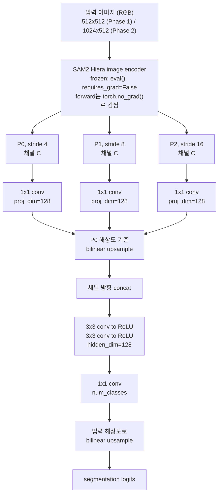

# SAM2 기반 Semantic Segmentation: CamVid → Cityscapes Frozen-Backbone Transfer

[](README.md)
[](README.kr.md)
[](https://www.python.org/)
[](https://pytorch.org/)
[](https://github.com/facebookresearch/sam2)
[](#license)

Pre-trained된 SAM2의 encoder를 완전히 freeze한 채로, 그 위에 경량 decoder만 새로 학습시켜
Semantic Segmentation에 얼마나 잘 transfer되는지, 그리고 그 결과가 특정 데이터셋에
overfitting된 게 아니라 실제로 일반화되는지를 검증하는 프로젝트이다.

- **Phase 1**: CamVid(701장)로 파일럿 파이프라인 구축, **test mIoU 0.7179** 달성.
- **Phase 2**: Cityscapes(train 2,975장)로 training 규모를 키우고, 학습에 전혀 쓰지 않은 CamVid에
  대해 **zero-shot cross-dataset 평가**를 진행 → **cross-dataset mIoU 0.7470**.

배경/설계 근거/확정된 하이퍼파라미터는 [`PROCESS.kr.md`](PROCESS.kr.md)
([영어 버전](PROCESS.md)도 있음) 참고.

## Contents

- [Key Results](#key-results)
- [Architecture](#architecture)
- [Repository Structure](#repository-structure)
- [Setup](#setup)
- [Phase 1: CamVid](#phase-1-camvid)
- [Phase 2: Cityscapes + Cross-Dataset Generalization](#phase-2-cityscapes--cross-dataset-generalization)
- [Pretrained Weights](#pretrained-weights)
- [Datasets and Licensing](#datasets-and-licensing)
- [Citation](#citation)
- [License](#license)

<a id="key-results"></a>
## 한눈에 보는 결과

| 평가 | mIoU | 비고 |
|---|---|---|
| Phase 1 — CamVid test split (11-class) | **0.7179** | 학습/모델 선택에 전혀 안 쓰인 held-out test |
| Phase 2 — Cityscapes val (19-class, in-domain) | **0.6437** | 모델 선택은 이 split 기준으로만 진행 |
| Phase 2 — CamVid 전체 (7-category, cross-dataset) | **0.7470** | 701장, Phase 2 학습 과정에 전혀 안 쓰임 |

Phase 2의 두 mIoU는 클래스 세분화 단위 자체가 달라(19-class vs 훨씬 coarse한 7-category)
직접 비교 대상은 아니지만([해석 및 한계](#interpretation-and-limitations) 참고), 둘을 같이
보면 "학습에 쓴 데이터셋에서만 동작하는 decoder"라는 신호는 전혀 없다.

| Input / Ground Truth / Prediction |
|---|
|  |
| *Phase 1 — CamVid test set* |
|  |
| *Phase 2 — Cityscapes 학습에 전혀 쓰이지 않은 CamVid* |

<a id="architecture"></a>
## 아키텍처

Encoder는 SAM2 Hiera image encoder(FPN neck 출력)를 순수 frozen feature extractor로만
사용한다. 학습되는 건 아래 decoder뿐이다.



- 채널 수 `C`와 정확한 feature 해상도는 가정하지 않고 실제 forward pass로 직접 측정했다
  (예: `tiny` 체크포인트, 512×512 입력 기준 3개 scale 전부 채널 256, 해상도
  128×128/64×64/32×32). decoder가 encoder의 실제 출력 채널 수를 그대로 읽어 쓰기 때문에
  (하드코딩 없음) Phase 1(`tiny`)과 Phase 2(`large`) 어느 SAM2 크기에서도 동일하게 적용된다.
- 구현: [`scripts/model.py`](scripts/model.py) (`SAM2Backbone`, `Decoder`, `SegModel`).

<a id="repository-structure"></a>
## 레포지토리 구조

```
camvid_seg_ws/
├── data/
│   ├── camvid/            # Phase 1 데이터셋 (git 미추적 — "환경 설정" 참고)
│   └── cityscapes/        # Phase 2 데이터셋 (git 미추적 — "환경 설정" 참고)
├── scripts/
│   ├── dataset.py             # CamVidDataset + CityscapesDataset
│   ├── model.py                # SAM2Backbone(frozen) + Decoder + SegModel
│   ├── train_common.py         # 공통 loss + 평가 루프
│   ├── build_class_map.py             # CamVid: class_dict.csv -> 32->11 매핑
│   ├── train.py / eval.py             # CamVid: 학습 / 평가
│   ├── build_class_map_cityscapes.py  # Cityscapes: labelId -> trainId 디코딩
│   ├── build_category_map.py          # CamVid11 <-> Cityscapes 7-category 매핑
│   ├── train_cityscapes.py / eval_phase2.py  # Cityscapes 학습 / 평가
│   └── visualize_cases.py     # best/worst case 정성적 시각화
├── checkpoints/            # SAM2 원본 가중치(미추적) + 학습된 decoder(추적됨)
├── outputs/                # figures/, results_phase1.json, results_phase2.json, 학습 로그
├── sam2/                   # SAM2, git submodule (facebookresearch/sam2)
└── PROCESS.md / PROCESS.kr.md  # 설계 근거, 확정된 하이퍼파라미터
```

<a id="setup"></a>
## 환경 설정

```bash
git clone --recurse-submodules <this-repo-url>
cd camvid_seg_ws

conda create -n camvidseg python=3.11
conda activate camvidseg

# torch/torchvision은 CUDA 12.6 wheel 기준으로 고정. 로컬 드라이버가 다르면
# index URL을 맞는 CUDA 버전으로 바꿀 것.
python -m pip install torch==2.14.0 torchvision==0.29.0 --index-url https://download.pytorch.org/whl/cu126
python -m pip install -r requirements.txt
python -m pip install -e ./sam2   # SAM2, submodule에서 editable install
```

SAM2 체크포인트는 이 레포에 포함되지 않으며 별도로 받아야 한다(submodule 안의
`sam2/checkpoints/download_ckpts.sh` 참고), `checkpoints/`에 위치. 데이터셋은 공식 CamVid /
Cityscapes 배포 구조 그대로 `data/camvid/raw/`, `data/cityscapes/raw/`에 위치시킨다 —
[데이터셋 및 라이선스](#데이터셋-및-라이선스) 참고.

## Phase 1: CamVid

### Design

- **encoder는 완전히 freeze하고 decoder만 training** — 대형 pre-trained 모델을 작은
  데이터셋에 통째로 fine-tuning하면 overfitting 및 기존 학습 망각 위험이 크다. 따라서
  frozen-backbone transfer learning 방식으로 진행했다.
- **클래스 색상은 하드코딩하지 않고 공식 `class_dict.csv`에서 직접 읽는다** — label 디코딩을
  잘못하면 모델이 처음부터 의미 없는 타겟으로 학습되어 버린다.

### Methodology

1. **Data**: CamVid(701장, train 421/val 112/test 168), 공식 32-class `class_dict.csv`
   배포본 사용. CamVid11(11클래스+Void)로 병합해야 했는데, MathWorks 공식 문서(SegNet 방식
   32→11 매핑)를 근거로 구현 — class_dict.csv의 31개 non-Void 클래스와 1:1 매칭됨을 코드에서
   assert로 강제 검증. 실제 label 이미지를 직접 대조해 정합성 확인 후 진행.
2. **Model**: SAM2 image encoder(FPN neck 출력, 3-scale 전부 고정 채널)를 `torch.no_grad()`로
   완전 고정하고, 그 위에 1×1 projection → bilinear upsample → concat → conv 3×3×2 → 1×1
   conv(11-class) 구조의 경량 decoder만 새로 학습. [아키텍처](#아키텍처) 참고.
3. **Training**: 입력 512×512(SAM2 기본 1024 대비 6배 빠름, 정확도 손실 없이 동작 확인),
   CrossEntropy + Dice 결합 loss(1:1), AdamW(lr=1e-3), batch size 32, random flip and random
   crop augmentation, 40 epoch. val mIoU 기준 best checkpoint를 저장했는데, 40 epoch 끝까지
   val mIoU가 계속(느리게) 개선되어 patience=8 early stop이 발동하지 않았다 — 마지막 epoch(40)이
   그대로 best checkpoint.
4. **Evaluation**: 학습/모델 선택에 전혀 쓰이지 않은 held-out **test split(168장)** 기준
   mIoU + 클래스별 IoU (torchmetrics, ignore_index=Void 제외).

### Result

**test mIoU: 0.7179** — 문헌에서 CamVid11에 흔히 보고되는 범위(대략 50~70%)의 상단권.

| 클래스 | IoU |
|---|---|
| Road | 0.9499 |
| Sky | 0.9267 |
| Building | 0.8833 |
| Car | 0.8656 |
| Tree | 0.8148 |
| Pavement | 0.7917 |
| Bicyclist | 0.7028 |
| SignSymbol | 0.5433 |
| Fence | 0.5372 |
| Pedestrian | 0.5735 |
| Pole | 0.3081 |

전체 수치: [`outputs/results_phase1.json`](outputs/results_phase1.json). 대표 시각화(원본/GT/예측 나란히):
`outputs/figures/eval_test_*.png`. 클래스 매핑 검증용 시각화: `outputs/figures/classmap_check_*.png`.

**Best & Worst Cases**: test 168장 전체를 이미지 단위로 채점해 상위/하위 5장을 뽑은
`outputs/figures/eval_test_best{1-5}_*.png` / `eval_test_worst{1-5}_*.png`도 있다
([`scripts/visualize_cases.py`](scripts/visualize_cases.py), 계산 방식과 공식 mIoU와 다른
이유는 `PROCESS.kr.md` "Qualitative Error Analysis" 참고). worst 케이스는 공통적으로 가로등 및
나뭇가지처럼 가는 구조물에서 나타난다.

| Worst case (가는 구조물 실패 사례) |
|---|
|  |

### Limitations (Phase 1)

- **가늘고 작은 물체(Pole, Fence, SignSymbol, Pedestrian)의 IoU가 낮다** — 문헌에 이미
  나와있어 예상된 현상(경량 decoder + 512 해상도이기 때문에 얇은 구조물의 경계를 정밀하게
  못 잡음)이었고, 파이프라인 버그가 아니다. 시각화로도 확인: 도로/하늘/건물처럼 크고 흔한
  영역은 GT와 정확히 겹치고, 가로등 및 나뭇가지 같은 매우 작고 가는 물체에서만 놓친다.
- **Bicyclist가 예상보다 높은 IoU(0.70)를 보임** — 다만, test split 안에 Bicyclist가
  등장하는 프레임 자체가 적어서 우연히 잘 맞았을 가능성이 있다. 더 큰 test set이나 클래스별
  표본 확인 없이는 일반화하기 어렵다.
- 이번 phase는 `sam2.1-hiera-tiny`만 사용했다 — 더 큰 체크포인트로 업그레이드하면 특히
  작은 클래스 IoU가 더 오를 가능성이 있다는 가설을 Phase 2에서 실제로 `large`로 검증함(아래 참고).

### 재현 방법

```bash
conda activate camvidseg
python scripts/build_class_map.py   # class_dict.csv -> lookup + 시각화 + label 인덱스 캐싱
python scripts/train.py             # 학습 (checkpoints/best_decoder.pt 저장)
python scripts/eval.py --split test # 최종 평가
```

<a id="phase-2-cityscapes--cross-dataset-generalization"></a>
## Phase 2: Cityscapes 확장 + Cross-Dataset 일반화

### Design

Phase 1은 단일 CamVid(701장)로만 학습/평가해서 "그 데이터셋 안에서" 잘 맞는지만 확인했었다.
Phase 2는 데이터 규모와 클래스별 표본수를 훨씬 큰 대형 벤치마크(Cityscapes)로 키우고,
**CamVid를 이 decoder 학습에 전혀 쓰지 않은 완전히 독립된 held-out cross-dataset
evaluation**으로 사용해서 "특정 데이터셋에 overfitting된 얕은 매핑이 아니라, 실제로
일반화되는 표현을 학습했는지"를 검증했다. 무작정 오래/많이 학습해서 같은 데이터셋 내부
지표만 올리는 방식에서 벗어나 실제 도메인 일반화 성능에 대한 증거를 얻기 위해, 모델
선택은 Cityscapes val로만 하고 CamVid는 학습 과정 내내 배제했다.

### Methodology

1. **Data**: Cityscapes fine(train 2,975 + val 500), 공식 `cityscapesScripts` 패키지의
   `labels.py`를 코드에서 직접 import해서 34-class id → 19-class trainId 디코딩(하드코딩 없음).
2. **cross-evaluation용 공통 taxonomy**: Cityscapes 공식 7-category(flat/construction/
   object/nature/sky/human/vehicle) 정의를 그대로 재사용해 CamVid11 클래스를 매핑. CamVid의
   Bicyclist(사람+자전거 미분리)는 Cityscapes의 rider(사람)/bicycle(사물) 분리와 안 맞아
   억지로 끼워맞추지 않고 cross-evaluation에서 제외함(ignore).
3. **Model**: SAM2 encoder를 `tiny`→**`large`**로 업그레이드. 입력은 Cityscapes 원본
   종횡비(2:1)를 유지한 **1024×512**으로 적용(정사각형 왜곡 없음) — SAM2 encoder가
   비정사각형 입력도 문제없이 처리함을 직접 확인했다.
4. **Training**: CrossEntropy + Dice 결합 loss, AdamW(lr=1e-3), batch size 8, random flip
   and random crop augmentation, 최대 60 epoch(patience 12 기준 **52epoch**에서 조기 종료,
   **epoch 40**이 best checkpoint).
5. **Evaluation**: (a) Cityscapes validation에서 19-class mIoU(문헌 비교용), (b) **CamVid
   701장 전체(학습에 전혀 안 씀)를 7-category로 합쳐서 cross-evaluation mIoU 계산**.

### Result

| 평가 | mIoU |
|---|---|
| Cityscapes validation (19-class, in-domain) | **0.6437** |
| CamVid 전체 701장 (7-category, held-out cross-evaluation) | **0.7470** |

Cityscapes 클래스별: `road` 0.97 / `sky` 0.94 / `car` 0.91처럼 크고 흔한 클래스는 높고,
`train` 0.29 / `bus` 0.41 / `motorcycle` 0.41 / `rider` 0.42처럼 작고 드문 클래스는 낮음.
CamVid 카테고리별로도 `flat` 0.98 / `sky` 0.86 / `construction` 0.86으로 높고 `object`(가는
물체류) 0.45로 가장 낮음 — Phase 1과 동일하게, "작고 가는 물체가 어렵다" 패턴이 완전히 다른
두 데이터셋에서 똑같이 재현되었다.

전체 수치: [`outputs/results_phase2.json`](outputs/results_phase2.json). label 디코딩 검증
visualization: `outputs/figures/classmap_check_cityscapes_*.png`. 대표 cross-evaluation
시각화(원본/GT/예측): `outputs/figures/cross_eval_*.png`.

**Best & Worst Cases**: cross-dataset evaluation 701장 전체를 이미지 단위로 채점해 Best/Worst
5장을 뽑은 `outputs/figures/cross_eval_best{1-5}_*.png` / `cross_eval_worst{1-5}_*.png`가
있다. worst 케이스에서는 '작고 가는 물체' 문제 외에, 그림자 진 구조물 아래에 실제로 없는
차량을 잘못 예측하는 도메인 이동(domain shift) 패턴이 2장에서 관찰됨(`PROCESS.kr.md` 참고).

| Worst case (도메인 이동 오탐) |
|---|
|  |

### Interpretation and Limitations

- **cross-evaluation mIoU(0.747)가 in-domain mIoU(0.644)보다 높게 나왔다.** 이걸
  "CamVid에서 더 잘한다"고 해석하면 안 된다 — 두 숫자는 클래스 세분화 단위 자체가 완전
  다르다(19-class vs 훨씬 coarse한 7-category, 카테고리가 원래 더 쉬움). 다만 최소한
  **"완전히 다른 카메라/도시/데이터셋으로 옮기면 성능이 붕괴한다"는 신호는 전혀 없다** —
  이게 이 Phase가 검증하려 한 핵심 가설에 대한 positive 증거다.
- Bicyclist를 cross-evaluation에서 제외한 것 자체가 "억지로 안 맞추기"라는 선택이긴 하다 —
  CamVid11의 모든 클래스가 이 공통 taxonomy로 완전히 깔끔하게 옮겨진 건 아니다.
- 작고 가는 물체(Cityscapes의 pole/traffic light/traffic sign, CamVid의 object 카테고리)는
  두 데이터셋 모두 상대적으로 약하다 — 경량 decoder + 실험한 해상도의 구조적인 한계로
  보이며, Phase 1에서 이미 확인된 패턴이 Phase 2에서 재현된 것이라 새로운 버그로 의심하지
  않았다.
- `small`/`base_plus` 등 다른 SAM2 크기와의 정량 비교, patience를 더 늘린 재학습은 시도하지
  않았다(large 하나로도 목표한 결과를 얻었기 때문).

### 재현 방법

```bash
conda activate camvidseg
python scripts/build_class_map_cityscapes.py   # Cityscapes label 디코딩 + 시각화까지
python scripts/build_category_map.py           # CamVid11 <-> Cityscapes 7-category 매핑
python scripts/train_cityscapes.py             # Training (checkpoints/best_decoder_cityscapes.pt 저장)
python scripts/eval_phase2.py                  # Cityscapes val + CamVid cross-evaluation, 둘 다 계산
```

<a id="pretrained-weights"></a>
## 학습된 가중치

학습된 decoder 가중치(작음, 각 ~2.7MB — SAM2 encoder 자체는 포함되지 않음)는 이 레포에
직접 추적된다:

| 파일 | 학습 데이터셋 | 결과 |
|---|---|---|
| `checkpoints/best_decoder.pt` | CamVid (Phase 1) | test mIoU 0.7179 |
| `checkpoints/best_decoder_cityscapes.pt` | Cityscapes (Phase 2) | val mIoU 0.6437 / CamVid cross-eval mIoU 0.7470 |

SAM2 원본 encoder 체크포인트(`sam2.1_hiera_*.pt`)는 여기서 재배포하지 않는다 — `sam2`
submodule 안의 공식 스크립트(`sam2/checkpoints/download_ckpts.sh`)로 직접 받을 것.

<a id="datasets-and-licensing"></a>
## 데이터셋 및 라이선스

이 레포는 데이터셋 이미지/라벨을 재배포하지 않는다. `data/`는 전부 git-ignore 처리되어
있으며, [환경 설정](#환경-설정)의 스크립트를 실행하면 각자 받은 원본 데이터로부터 파생
라벨 파일을 로컬에서 그대로 재생성한다(각 데이터셋 고유의 라이선스 조건 하에):

- **CamVid** — Cambridge-driving Labeled Video Database.
  [공식 CamVid 페이지](http://mi.eng.cam.ac.uk/research/projects/VideoRec/CamVid/)의
  이용 조건 참고.
- **Cityscapes** — [Cityscapes Dataset license agreement](https://www.cityscapes-dataset.com/license/)
  (연구/비상업적 이용) 참고. `outputs/figures/`의 정성적 결과 이미지에는 모델 동작을
  보여주기 위한 Cityscapes/CamVid validation 이미지의 작은 crop이 포함되어 있으며, 이는
  공개된 segmentation 연구 관행과 일치하는 방식이다. 상업적으로 재사용할 계획이라면 각
  데이터셋 라이선스를 별도로 검토할 것.
- **SAM2** — Apache License 2.0. [facebookresearch/sam2](https://github.com/facebookresearch/sam2)를
  가리키는, 수정 없는 git submodule로 포함. `sam2/LICENSE` 참고.

## Citation

If you build on this work, please also cite the underlying models and datasets:

```bibtex
@article{ravi2024sam2,
  title={SAM 2: Segment Anything in Images and Videos},
  author={Ravi, Nikhila and Gabeur, Valentin and Hu, Yuan-Ting and others},
  journal={arXiv preprint arXiv:2408.00714},
  year={2024}
}

@inproceedings{brostow2009camvid,
  title={Semantic object classes in video: A high-definition ground truth database},
  author={Brostow, Gabriel J and Fauqueur, Julien and Cipolla, Roberto},
  booktitle={Pattern Recognition Letters},
  year={2009}
}

@inproceedings{cordts2016cityscapes,
  title={The Cityscapes Dataset for Semantic Urban Scene Understanding},
  author={Cordts, Marius and Omran, Mohamed and Ramos, Sebastian and others},
  booktitle={CVPR},
  year={2016}
}
```

## License

No license is granted for this repository's own code (all rights reserved by default).
This applies only to the code and results authored here — it does not affect the
SAM2 submodule (Apache License 2.0, see `sam2/LICENSE`) or the terms of the CamVid /
Cityscapes datasets referenced above, both of which remain governed by their own licenses
regardless of this repository's license.
