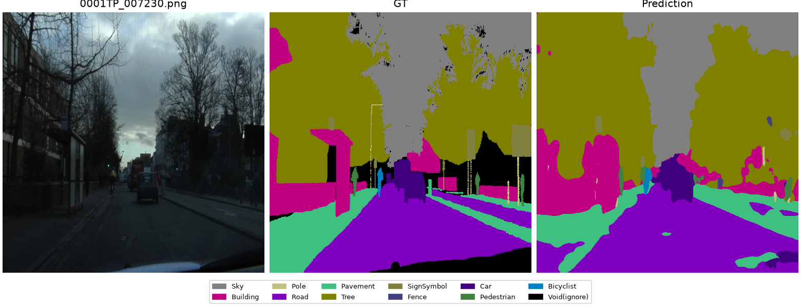
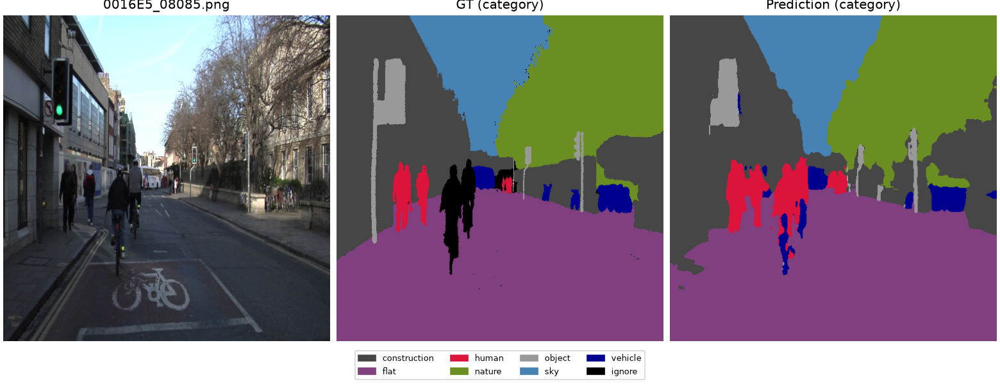
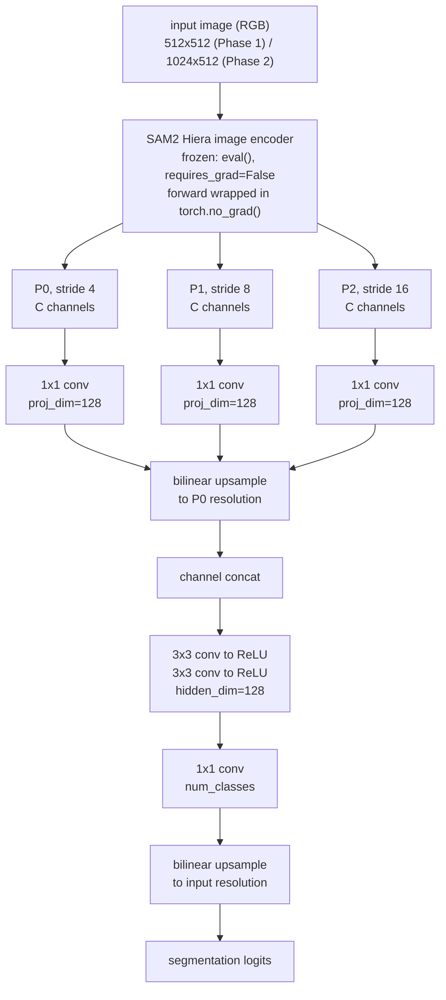
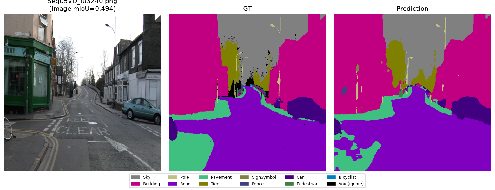
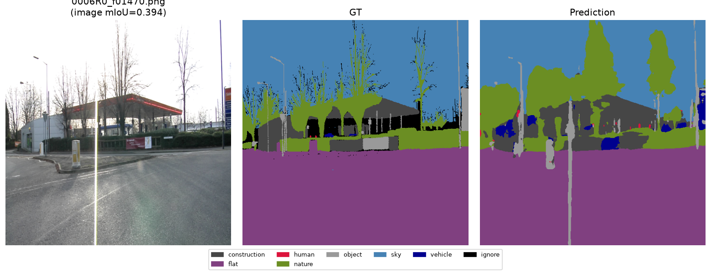

# SAM2-Based Semantic Segmentation: Frozen-Backbone Transfer from CamVid to Cityscapes

[](README.md)
[](README.kr.md)
[](https://www.python.org/)
[](https://pytorch.org/)
[](https://github.com/facebookresearch/sam2)
[](#license)

This repository studies how well a **frozen SAM2 image encoder** transfers to semantic
segmentation when only a lightweight decoder head is trained on top of it, and whether
the resulting representation generalizes across datasets or merely overfits to one.

- **Phase 1** trains and evaluates a decoder on CamVid (701 images) as a pilot pipeline: **0.7179 test mIoU**.
- **Phase 2** scales training to Cityscapes (2,975 train images) and evaluates the resulting decoder
  **zero-shot on CamVid** — a dataset it never saw during training — as a fully held-out
  cross-dataset generalization test: **0.7470 cross-dataset mIoU**.

Design rationale and confirmed hyperparameters are documented in [`PROCESS.md`](PROCESS.md)
([Korean version](PROCESS.kr.md) also available).

## Contents

- [Key Results](#key-results)
- [Architecture](#architecture)
- [Repository Structure](#repository-structure)
- [Setup](#setup)
- [Phase 1: CamVid](#phase-1-camvid)
- [Phase 2: Cityscapes + Cross-Dataset Generalization](#phase-2-cityscapes--cross-dataset-generalization)
- [Pretrained Weights](#pretrained-weights)
- [Datasets and Licensing](#datasets-and-licensing)
- [Citation](#citation)
- [License](#license)

## Key Results

| Evaluation | mIoU | Notes |
|---|---|---|
| Phase 1 — CamVid test split (11-class) | **0.7179** | Held-out test set, never used for training or model selection |
| Phase 2 — Cityscapes val (19-class, in-domain) | **0.6437** | Model selection uses this split only |
| Phase 2 — CamVid full set (7-category, cross-dataset) | **0.7470** | 701 images, entirely unseen during Phase 2 training |

The two mIoU numbers in Phase 2 are not directly comparable (19-class vs. a coarser
7-category taxonomy — see [Phase 2 Interpretation](#interpretation-and-limitations)), but
together they show no sign of a decoder that only works on the dataset it was trained on.

| Input / Ground Truth / Prediction |
|---|
|  |
| *Phase 1 — CamVid test set* |
|  |
| *Phase 2 — CamVid, held out entirely from Cityscapes training* |

## Architecture

The encoder is the SAM2 Hiera image encoder (FPN neck output), used purely as a frozen
feature extractor. Only the decoder below is trained.



- Channel width `C` and exact feature resolutions are measured directly from a forward
  pass rather than assumed (e.g. for a 512x512 input with the `tiny` checkpoint, all
  three scales come out at 256 channels, resolutions 128x128/64x64/32x32). This holds
  for every SAM2 variant used (`tiny` in Phase 1, `large` in Phase 2) since the decoder
  reads the channel count from the encoder's actual output shape instead of hardcoding it.
- Implementation: [`scripts/model.py`](scripts/model.py) (`SAM2Backbone`, `Decoder`, `SegModel`).

## Repository Structure

```
camvid_seg_ws/
├── data/
│   ├── camvid/            # Phase 1 dataset (not tracked in git — see Setup)
│   └── cityscapes/        # Phase 2 dataset (not tracked in git — see Setup)
├── scripts/
│   ├── dataset.py             # CamVidDataset + CityscapesDataset
│   ├── model.py                # SAM2Backbone (frozen) + Decoder + SegModel
│   ├── train_common.py         # shared loss + eval loop
│   ├── build_class_map.py             # CamVid: class_dict.csv -> 32->11 label mapping
│   ├── train.py / eval.py             # CamVid: training / evaluation
│   ├── build_class_map_cityscapes.py  # Cityscapes: labelId -> trainId decoding
│   ├── build_category_map.py          # CamVid11 <-> Cityscapes 7-category mapping
│   ├── train_cityscapes.py / eval_phase2.py  # Cityscapes training / evaluation
│   └── visualize_cases.py     # best/worst case qualitative visualization
├── checkpoints/            # SAM2 base weights (not tracked) + trained decoders (tracked)
├── outputs/                # figures/, results_phase1.json, results_phase2.json, train logs
├── sam2/                   # SAM2, as a git submodule (facebookresearch/sam2)
└── PROCESS.md / PROCESS.kr.md  # design rationale, confirmed hyperparameters
```

## Setup

```bash
git clone --recurse-submodules <this-repo-url>
cd camvid_seg_ws

conda create -n camvidseg python=3.11
conda activate camvidseg

# torch/torchvision pinned to a CUDA 12.6 wheel build; adjust the index URL
# to match your driver if you are not on CUDA 12.6.
python -m pip install torch==2.14.0 torchvision==0.29.0 --index-url https://download.pytorch.org/whl/cu126
python -m pip install -r requirements.txt
python -m pip install -e ./sam2   # SAM2, editable install from the submodule
```

SAM2 checkpoints are downloaded separately (not part of this repo — see `sam2/checkpoints/download_ckpts.sh`
in the submodule) into `checkpoints/`. Datasets are placed under `data/camvid/raw/` and
`data/cityscapes/raw/` following the official CamVid / Cityscapes distribution layout —
see [Datasets and Licensing](#datasets-and-licensing).

## Phase 1: CamVid

### Design

- **The encoder is frozen; only the decoder is trained.** Fully fine-tuning a large
  pretrained model on a small dataset risks both overfitting and catastrophic forgetting,
  so this project uses frozen-backbone transfer learning instead.
- **Class colors are never hardcoded.** The RGB-to-class-index mapping is read directly
  from the official `class_dict.csv` at runtime — an incorrect decoding here would train
  the model against meaningless targets from the start.

### Methodology

1. **Data**: CamVid (701 images; train 421 / val 112 / test 168), decoded from the official
   32-class `class_dict.csv`. Classes are merged into CamVid11 (11 classes + Void) following
   the MathWorks reference mapping (the SegNet-style 32-to-11 grouping); the mapping is
   asserted in code to cover all 31 non-Void classes 1:1, and cross-checked visually against
   real label images before training.
2. **Model**: the SAM2 image encoder (FPN neck output, all scales fixed-channel) is frozen
   under `torch.no_grad()`. On top, a lightweight decoder does 1x1 projection -> bilinear
   upsample -> concat -> 3x3 conv x2 -> 1x1 conv (11 classes). See [Architecture](#architecture).
3. **Training**: 512x512 input (6x faster than SAM2's default 1024, with no measured accuracy
   loss), combined CrossEntropy + Dice loss (1:1), AdamW (lr=1e-3), batch size 32, random
   flip + random crop augmentation, 40 epochs. Best checkpoint by val mIoU; val mIoU improved
   (slowly) through the full 40 epochs, so early stopping (patience=8) never triggered — the
   final epoch (40) is the best checkpoint.
4. **Evaluation**: mIoU + per-class IoU (torchmetrics, Void excluded via `ignore_index`) on
   the held-out **test split (168 images)**, never used for training or model selection.

### Result

**Test mIoU: 0.7179** — near the top of the range commonly reported for CamVid11 in the
literature (roughly 50-70%).

| Class | IoU |
|---|---|
| Road | 0.9499 |
| Sky | 0.9267 |
| Building | 0.8833 |
| Car | 0.8656 |
| Tree | 0.8148 |
| Pavement | 0.7917 |
| Bicyclist | 0.7028 |
| SignSymbol | 0.5433 |
| Fence | 0.5372 |
| Pedestrian | 0.5735 |
| Pole | 0.3081 |

Full numbers: [`outputs/results_phase1.json`](outputs/results_phase1.json). Representative qualitative
results (input / ground truth / prediction): `outputs/figures/eval_test_*.png`. Class-mapping
validation visualizations: `outputs/figures/classmap_check_*.png`.

**Best & worst cases**: all 168 test images were scored individually to select the top/bottom
5 (`outputs/figures/eval_test_best{1-5}_*.png` / `eval_test_worst{1-5}_*.png`, produced by
[`scripts/visualize_cases.py`](scripts/visualize_cases.py); this per-image score differs from
the official mIoU — see `PROCESS.md`, "Qualitative Error Analysis"). Worst cases consistently involve
thin structures such as lamp posts and tree branches.

| Worst case (thin-structure failure) |
|---|
|  |

### Limitations (Phase 1)

- **Thin, small objects (Pole, Fence, SignSymbol, Pedestrian) have low IoU.** This matches
  prior literature and is expected given a lightweight decoder at 512px resolution (it
  cannot resolve fine boundaries precisely) — not a pipeline bug. Visual inspection confirms
  large, common regions (road/sky/building) align closely with ground truth, and only thin,
  small structures are missed.
- **Bicyclist IoU (0.70) is higher than expected.** The test split contains few frames with
  Bicyclist present, so this may be partly a small-sample effect rather than a robust result.
- This phase used only `sam2.1-hiera-tiny`. The hypothesis that a larger checkpoint would
  particularly help small-object IoU is tested directly in Phase 2 with `large` (see below).

### Reproduction

```bash
conda activate camvidseg
python scripts/build_class_map.py   # class_dict.csv -> lookup + validation figures + cached label indices
python scripts/train.py             # training (saves checkpoints/best_decoder.pt)
python scripts/eval.py --split test # final evaluation
```

## Phase 2: Cityscapes + Cross-Dataset Generalization

### Design

Phase 1 trained and evaluated on a single dataset (CamVid), so it only shows whether the
decoder fits *that* dataset well. Phase 2 scales training data and per-class sample counts
up to a much larger benchmark (Cityscapes), and uses **CamVid — entirely excluded from
decoder training — as a fully independent held-out cross-dataset evaluation**, to test
whether the model learned a representation that actually generalizes, rather than a mapping
that overfits one dataset. This was also a deliberate methodological choice: rather than
simply training longer to improve an in-domain metric, model selection uses Cityscapes val
mIoU only, and CamVid is excluded from the entire training loop, so the cross-dataset number
is real evidence about generalization rather than a metric that was implicitly optimized for.

### Methodology

1. **Data**: Cityscapes fine annotations (train 2,975 + val 500), decoded from 34 label IDs
   to 19 train IDs by importing the official `labels.py` table from the `cityscapesscripts`
   package directly (no hardcoded IDs).
2. **Common taxonomy for cross-evaluation**: CamVid11 classes are mapped onto Cityscapes'
   official 7-category grouping (flat / construction / object / nature / sky / human /
   vehicle). CamVid's `Bicyclist` (person and bicycle not separated) does not map cleanly
   onto Cityscapes' separate `rider` (human) and `bicycle` (vehicle) classes, so it is
   excluded (ignored) from cross-evaluation rather than forced into either category.
3. **Model**: the SAM2 encoder is upgraded from `tiny` to **`large`**. Input resolution is
   **1024x512**, preserving Cityscapes' native 2:1 aspect ratio (no square-resize distortion);
   the SAM2 encoder was confirmed to handle non-square inputs correctly.
4. **Training**: combined CrossEntropy + Dice loss, AdamW (lr=1e-3), batch size 8, random
   flip + random crop augmentation, max 60 epochs with early stopping (patience=12) —
   training stopped at **epoch 52**, with the **best checkpoint at epoch 40**.
5. **Evaluation**: (a) 19-class mIoU on Cityscapes validation (for literature comparison),
   and (b) 7-category mIoU on the **full 701-image CamVid set** (never used in training) as
   the cross-dataset generalization test.

### Result

| Evaluation | mIoU |
|---|---|
| Cityscapes validation (19-class, in-domain) | **0.6437** |
| CamVid, all 701 images (7-category, held-out cross-evaluation) | **0.7470** |

Per-class Cityscapes results follow the expected pattern: large, common classes score
highest (`road` 0.97 / `sky` 0.94 / `car` 0.91) while small, rare classes score lowest
(`train` 0.29 / `bus` 0.41 / `motorcycle` 0.41 / `rider` 0.42). CamVid per-category results
show the same pattern (`flat` 0.98 / `sky` 0.86 / `construction` 0.86, vs. `object` 0.45 for
thin structures) — the "thin/small objects are hard" failure mode reproduces identically
across two unrelated datasets.

Full numbers: [`outputs/results_phase2.json`](outputs/results_phase2.json). Label-decoding
validation figures: `outputs/figures/classmap_check_cityscapes_*.png`. Representative
cross-evaluation qualitative results: `outputs/figures/cross_eval_*.png`.

**Best & worst cases**: all 701 cross-evaluation images were scored individually to select
the top/bottom 5 (`outputs/figures/cross_eval_best{1-5}_*.png` / `cross_eval_worst{1-5}_*.png`).
Beyond the thin-object failure mode, 2 worst-case images show a domain-shift pattern: the
model predicts a vehicle under a shadowed structure where none exists (see `PROCESS.md`).

| Worst case (domain-shift false positive) |
|---|
|  |

### Interpretation and Limitations

- **The cross-evaluation mIoU (0.747) is higher than the in-domain mIoU (0.644).** This
  should not be read as "the model does better on CamVid" — the two numbers use different
  class granularities (19-class vs. a much coarser 7-category grouping, which is inherently
  easier). What it does show is **no sign of the collapse you would expect if the model only
  worked on the exact cameras/cities/dataset it was trained on** — the positive result this
  phase was designed to test for.
- Excluding Bicyclist from cross-evaluation is itself a judgment call: not every CamVid11
  class maps cleanly onto this common taxonomy.
- Thin, small objects (Cityscapes' pole/traffic light/traffic sign; CamVid's `object`
  category) remain the weak point in both datasets — consistent with a structural limitation
  of a lightweight decoder at this resolution, not a new bug, since the same pattern was
  already observed in Phase 1.
- No quantitative comparison against other SAM2 sizes (`small`/`base_plus`) or longer-patience
  retraining was run — `large` alone met the goal of this phase.

### Reproduction

```bash
conda activate camvidseg
python scripts/build_class_map_cityscapes.py   # Cityscapes label decoding + validation figures
python scripts/build_category_map.py           # CamVid11 <-> Cityscapes 7-category mapping
python scripts/train_cityscapes.py             # training (saves checkpoints/best_decoder_cityscapes.pt)
python scripts/eval_phase2.py                  # Cityscapes val + CamVid cross-evaluation
```

## Pretrained Weights

Trained decoder weights (small, ~2.7MB each — architecture only, the SAM2 encoder is not
included) are tracked directly in this repository:

| File | Trained on | Result |
|---|---|---|
| `checkpoints/best_decoder.pt` | CamVid (Phase 1) | 0.7179 test mIoU |
| `checkpoints/best_decoder_cityscapes.pt` | Cityscapes (Phase 2) | 0.6437 val mIoU / 0.7470 CamVid cross-eval |

SAM2 base encoder checkpoints (`sam2.1_hiera_*.pt`) are **not** redistributed here; download
them via the official script in the `sam2` submodule
(`sam2/checkpoints/download_ckpts.sh`).

## Datasets and Licensing

This repository does not redistribute dataset images or annotations. `data/` is entirely
git-ignored; running the scripts in [Setup](#setup) regenerates all derived label files
locally from data you download yourself, under each dataset's own terms:

- **CamVid** — Cambridge-driving Labeled Video Database. See the
  [official CamVid page](http://mi.eng.cam.ac.uk/research/projects/VideoRec/CamVid/) for
  terms of use.
- **Cityscapes** — see the
  [Cityscapes Dataset license agreement](https://www.cityscapes-dataset.com/license/)
  (research, non-commercial use). Qualitative figures in `outputs/figures/` include small
  crops from Cityscapes/CamVid validation images for the purpose of illustrating model
  behavior, consistent with common practice in published segmentation research; if you plan
  to reuse this repository commercially, review the dataset licenses independently.
- **SAM2** — Apache License 2.0, included as an unmodified git submodule pointing at
  [facebookresearch/sam2](https://github.com/facebookresearch/sam2). See `sam2/LICENSE`.

## Citation

If you build on this work, please also cite the underlying models and datasets:

```bibtex
@article{ravi2024sam2,
  title={SAM 2: Segment Anything in Images and Videos},
  author={Ravi, Nikhila and Gabeur, Valentin and Hu, Yuan-Ting and others},
  journal={arXiv preprint arXiv:2408.00714},
  year={2024}
}

@inproceedings{brostow2009camvid,
  title={Semantic object classes in video: A high-definition ground truth database},
  author={Brostow, Gabriel J and Fauqueur, Julien and Cipolla, Roberto},
  booktitle={Pattern Recognition Letters},
  year={2009}
}

@inproceedings{cordts2016cityscapes,
  title={The Cityscapes Dataset for Semantic Urban Scene Understanding},
  author={Cordts, Marius and Omran, Mohamed and Ramos, Sebastian and others},
  booktitle={CVPR},
  year={2016}
}
```

## License

No license is granted for this repository's own code (all rights reserved by default).
This applies only to the code and results authored here — it does not affect the
SAM2 submodule (Apache License 2.0, see `sam2/LICENSE`) or the terms of the CamVid /
Cityscapes datasets referenced above, both of which remain governed by their own licenses
regardless of this repository's license.
